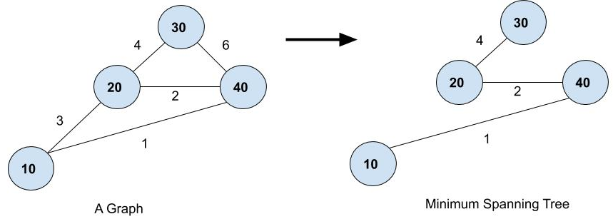
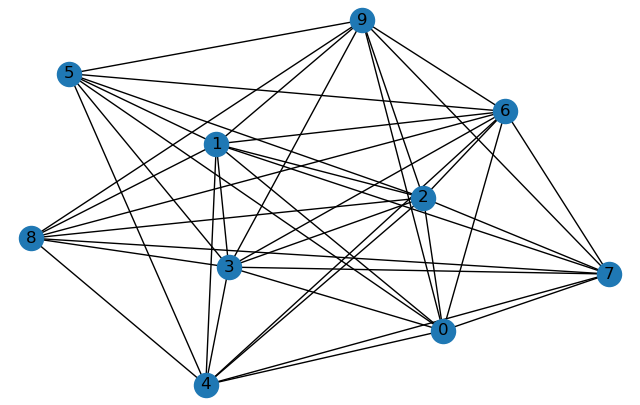
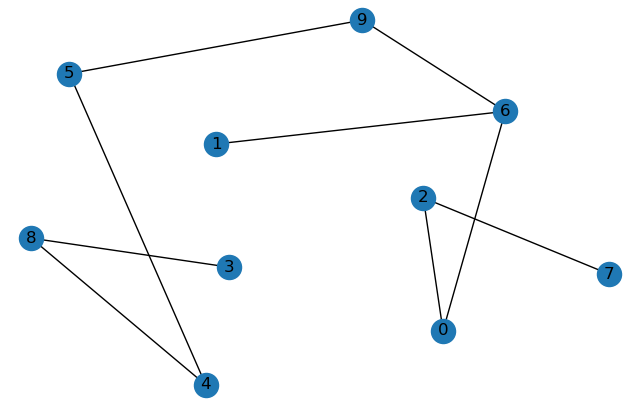
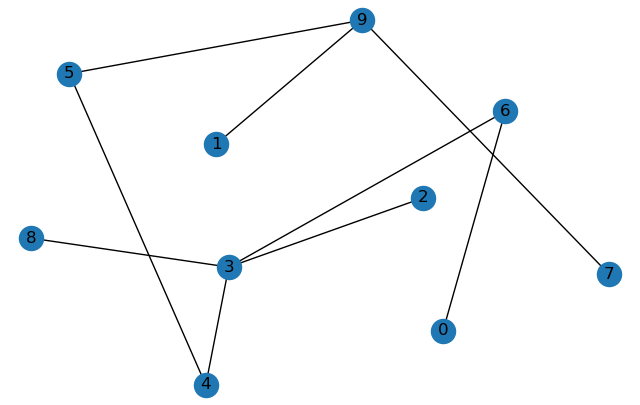
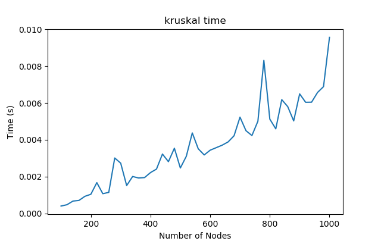
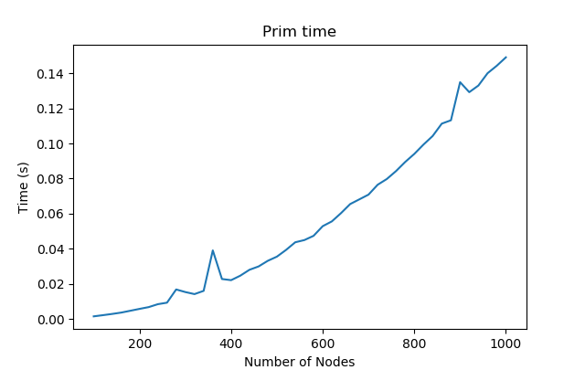
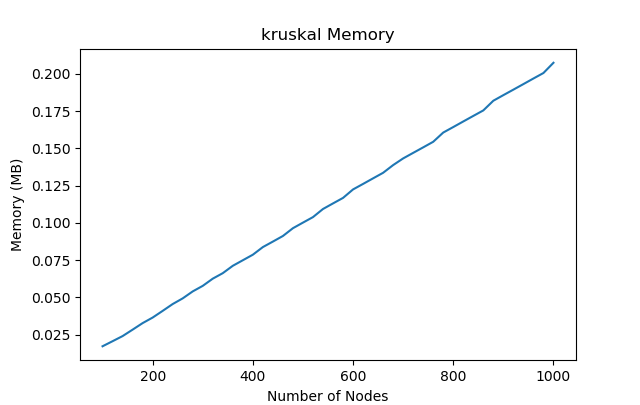
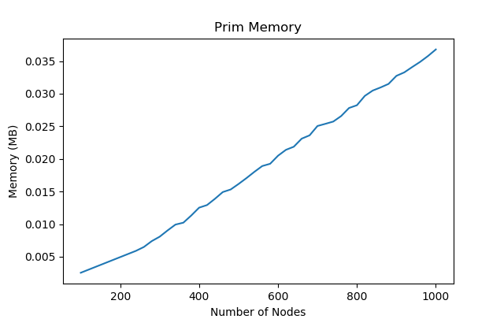

# Comparision of MST algorithms

In this project we compared two famous MST algorithms 
[Krushkal](https://www.google.com/url?sa=t&rct=j&q=&esrc=s&source=web&cd=&cad=rja&uact=8&ved=2ahUKEwjUr7C_3cfpAhUB6nMBHdSOCLEQFjALegQIARAB&url=https%3A%2F%2Fen.wikipedia.org%2Fwiki%2FPrim%2527s_algorithm&usg=AOvVaw0Pg5Xyc6ArbCbwonuh6fue) and 
[Prims](https://www.google.com/url?sa=t&rct=j&q=&esrc=s&source=web&cd=&cad=rja&uact=8&ved=2ahUKEwjUr7C_3cfpAhUB6nMBHdSOCLEQFjALegQIARAB&url=https%3A%2F%2Fen.wikipedia.org%2Fwiki%2FPrim%2527s_algorithm&usg=AOvVaw0Pg5Xyc6ArbCbwonuh6fue)
on parameters like Time and Memory nned to create a MST.

## What is a MST?
MST - Minimum Spanning Tree is a subset of a graph which contains all the nodes connected to each other by edges such that they don't form a cycle with minimum total edge weaight

### Project Structure
The Algorithms are in [MST](MST) folder in seprate files [Krushkal.py](MST/Krushkal.py) and [Prims.py](MST/Prims.py) having their own classes which simplifies using them in other files. The script that does the comparision is [generate_results.py](generate_results.py)

### Hardware and Software used 
This project is implemented on Core i7 7500 CPU 2.83 GHz with 8GB of DDR4 RAM. The algorithms are implemented using Python3. Networks are generated using the networkx module of Python3.

## Here are some result that we got from our analysis

Orignal Graph | MST Created by Kruskal Algorithm | MST Created by Prim Algorithm
----- | ----- | ----
 |  | 

Number of Nodes vs Time(s) for Kruskal | Number of Nodes vs Time(s) for Prime
---- | ---- 
 |

Number of Nodes vs Memory for Kruskal | Number of Nodes vs Memory for Kruskal
---- | ---- 
 | 

## Conclusion
Kruskal takes more space but 15 folds less time than that of prim’s algorithm. In today’s world, space is not an issue, but time is. The controller needs to build MST quickly. So Kruskal’s algorithm suits best for the MST construction for the TEDP.

<table>
    <thead>
        <tr>
            <th> Number of Nodes </th>
            <th colspan=2> Prim's Algorithm </th>
            <th colspan=2> Kruskal’s Algorithm </th>
        </tr>
        <tr>
            <td>&nbsp;</td>
            <td>Time (s) </td>
            <td> Memory </td>
            <td>Time (s) </td>
            <td> Memory </td>
        </tr>
    </thead>
    <tbody>
        <tr>
            <td>200-400</td>
            <td>0.02</td>
            <td>0.008</td>
            <td>0.001</td>
            <td>0.05</td>
        </tr>
        <tr>
            <td>401-600</td>
            <td>0.03</td>
            <td>0.018</td>
            <td>0.003</td>
            <td>0.1</td>
        </tr>
        <tr>
            <td>601-800</td>
            <td>0.08</td>
            <td>0.026</td>
            <td>0.005</td>
            <td>0.15</td>
        </tr>
        <tr>
            <td>801-1000</td>
            <td>0.13</td>
            <td>0.033</td>
            <td>0.007</td>
            <td>0.18</td>
        </tr>
    </tbody>
</table>

This increase in efficiency in building MST can be used by SDN controllers to build updated MST of Switches/SDN routers under sudden changes in the network. It will allow the controller to update flow tables with the shortest route with the updated MST of topology with minimum delay and hence achieve a better network performance by avoiding unnecessary pack-drops and congestion in the network.